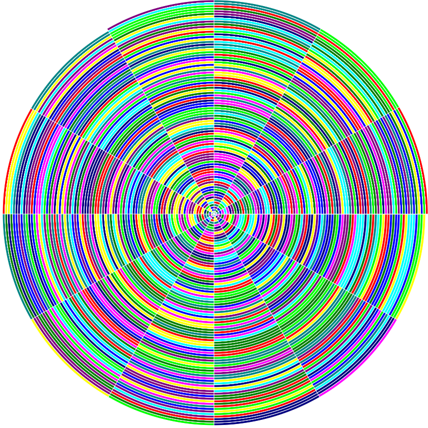

# colorin-colorado

Program that allows you to encode files as SVG images with different shapes and colors. 
Or interpreted them as music notes (pending feature!).

## Study case: Another way of looking at Prime numbers.

Encoding files as images sometimes allows you to shift your perspective about certain data, by doing so, you can find patterns that sometimes are not visible at first sight, or that you don't see because you are used to think about that data in a certain way. Anyway, I won't lie you, other times it is just a funny way to represent data and nothing else, but I think that's ok too. That been said, this time we are going to try by encoding some famous numbers using different shapes and see what we get! Let's roll the dice!

At time of writing this, colorin-colorado `image-encoder` allows you to pick between 3 different shapes, and 3 different kinds of color palettes:

```
image-encoder allows you to encode any file into different types of images

Usage: image-encoder (-s|--shape SHAPE) (-f|--format FORMAT) SRC [PALETTE_FILE]

Available options:
  -h,--help                Show this help text
  -s,--shape SHAPE         Image shape. Options: matrix | line | eliptical
  -f,--format FORMAT       Image format. Options: rgb | rgba | palette
                           PALETTE_FILE
  SRC                      The source file path to encode
  PALETTE_FILE             If you choose format palette you must pass a palette
                           spec file (expected format .json)
```

As you can see, we have different combinations to play with, but for now we are going to focus on `matrix` and `elpitical` shapes with a handmade `palette` (specialized to point out numbers, characters and special bytes with colors that are easy to remember). Even more, for the following examples we just care about colors, so let me introduce a simplified reference map only with them:

```
Number | Color                | Hex Format
0      | red                  | #ff0000
1      | green                | #00ff00
2      | yellow               | #ffff00
3      | blue                 | #0000ff
4      | pink                 | #ff00ff
5      | aqua                 | #00ffff 
6      | "deep" blue          | #000080 
7      | "soft" green         | #008000
8      | "soft" purple        | #800080 
9      | "soft green-purple"  | #008686
``` 

In terms of shapes, `matrix` are generated by horizontaly piling sub-squares (1 square per byte using the given color), and changing to the next row every time it is required, taking in consideration we want a big square figure as a final result.
On the other hand, `eliptical` shapes are generated by drawing "eliptical squares" using a 30 degress angle per iteration with counter clockwise direction. Lastly, once we reach a full cicle (12 iterations), radius is increased. This sounds tricky and obscure in words (what is a "eliptical square" anyway?), but trust me, after you see the picture it will be easy to understand.

Ok, enough parsimonia, let's see some examples!
What happen if we try to "colored" the first 1000 digits of PI? (just in case, they looks like: `31415...a few more...216420198`)

```nix
λ cabal run image-encoder -- -s matrix -f palette ./examples/pi_1000.txt ./palette/handmade.json
```


So far so good, this matrix looks funny, but nothing special. Let's try with a different shape now:

```nix
λ cabal run image-encoder -- -s eliptical -f palette ./examples/pi_1000.txt ./palette/handmade.json
```



Oh! this one looks prettier than the previous one, but did you see a pattern? At least for me, I can't get too much from this picture. So the question I'm asking now is, what happen if we try to encode other sequence or number? Let's try with the first 1000 pair numbers (`2,4,6,8,10,...,996,998,1000`) but, for practice reasons, let's concatenate them, so in that case we obtain the following number `246810...9969981000`.

```nix
λ cabal run image-encoder -- -s eliptical -f palette ./examples/pair_1000.txt ./palette/handmade.json
```


Sweet! that shape show us certain pattern. What about odd numbers? should we expect another pattern, right?
Ok, by applying the same logic we will have: `13579...995997999`.

```nix
λ cabal run image-encoder -- -s eliptical -f palette ./examples/odd_1000.txt ./palette/handmade.json
```


Indeed, another pattern (that was expectable)... Now, for our final act, what about prime numbers? Those mithycal numbers that no one could find their series (yet!), those numbers that seems to hide the secrets of how we conceive our universe...hehe, ok enough drama...should we expect a pattern for them? I guess the answer is yes, despite I'm not sure if that can provide insight for current misteries around them, let's see how it goes when we try to encode the first 1000 prime numbers (`235711...790179077919`).

```nix
λ cabal run image-encoder -- -s eliptical -f palette ./examples/primes_1000.txt ./palette/handmade.json
```


Amaizing, rihgt? I mean, it looks to me that there is certain pattern, a much more complex one than the previous examples, probably not that easy to explain, but intuition tells me there is a pattern and my eyes try to convince me...Well TBH I'm not 100% convinved yet, but I can see some things, for instance, if we took the first 100 (equivalent to zoom in over the previous image), we will notice that some patterns start in a certain region, and then appears in other ones with a different scale...
To summarize, other stuff can be noticed too, but I prefer the reader makes their own analysis and take their own conclusions.

```nix
λ cabal run image-encoder -- -s eliptical -f palette ./examples/primes_100.txt ./palette/handmade.json
```


Anyway, my wish is that some mathematician reach this and provide me more insight about it! But in any case, I think that this is a nice example of how seeing things from a different perspective can help you or motivate new ideas.
I hope you enjoyed this little experiment as much as I did (thanks for reading it!), and please feel free to collaborate with the project, play with it, and share your results! Also if you have questions, find an issue or do you want to make a request, just create an issue (or PR) in the repository.

Happy coding! ~ mk from [emeks](https://www.emeks.com.ar/en/index.html).

### Usefull links

- [Examples used in the study case (with their whole resolution)](./examples)
- [El Patrón de los Números Primos](https://www.jasondavies.com/primos/)
- [the canterbury corpus](https://corpus.canterbury.ac.nz/descriptions/#cantrbry)

## Development

1. Enter nix development shell:

```bash
nix develop
```

Obs: The first time this will take some time, meanwhile, you can drink mate and listen good cumbia

2. Compile the project

```bash 
# inside nix shell
cabal build
```

3. Run image-encoder executable

```bash 
# inside nix shell
cabal run image-encoder
```

### Update cachix

```bash
nix develop --profile colorin-colorado-dev-profile
# inside nix shell
export CACHIX_AUTH_TOKEN=$AUTH_TOKEN; cachix push emeks-public colorin-colorado-dev-profile 
```

Ref. https://docs.cachix.org/pushing#pushing-flake-inputs
